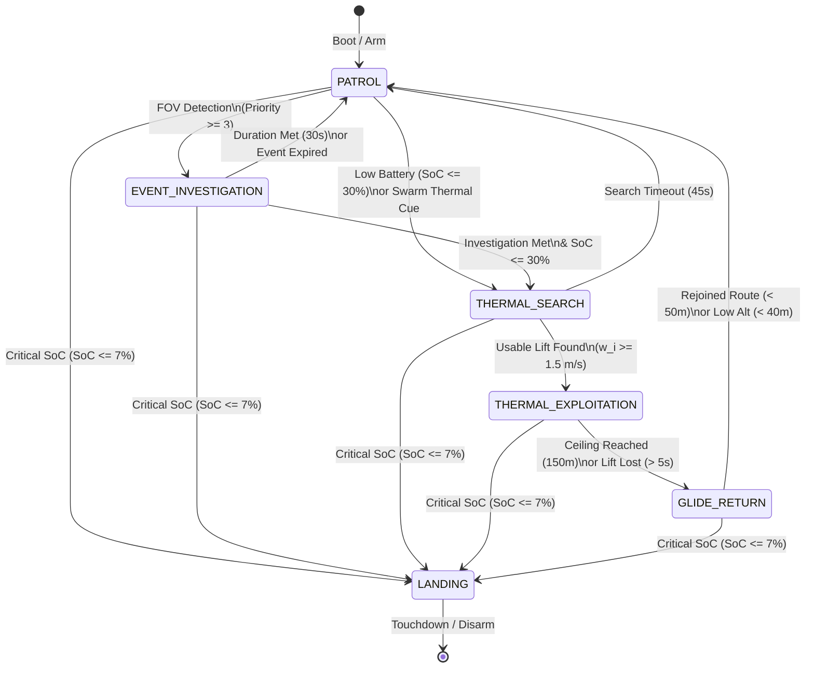

# Finite State Machine Autonomy (Step 4b)

This document describes the design, implementation, and interfaces of the decentralized Finite State Machine (FSM) running independently on each UAV.

---

## 1. FSM State Diagram

The FSM comprises 6 distinct operational states:

---

## 2. State & Transition Descriptions

| State | Controller / MAVSDK Command | Transition Triggers | Action on Transition |
|---|---|---|---|
| **PATROL** | Mission Plugin (`start_mission`) | 1. `SoC <= 30%` -> `THERMAL_SEARCH` 2. High-priority FOV event -> `EVENT_INVESTIGATION` 3. Swarm `ThermalCue` received -> `THERMAL_SEARCH` 4. `SoC <= 7%` -> `LANDING` | `upload_patrol_mission`, resume waypoint path |
| **EVENT_INVESTIGATION** | Action Plugin (`do_orbit`) | 1. Duration met (30s) -> `PATROL` 2. Event expired -> `PATROL` 3. `SoC <= 7%` -> `LANDING` | Orbit event location with 50m radius |
| **THERMAL_SEARCH** | Action Plugin (`goto_location`) | 1. Usable lift ($w_i \ge 1.5$ m/s) -> `THERMAL_EXPLOITATION` 2. Timeout (45s) -> `PATROL` 3. `SoC <= 7%` -> `LANDING` | Fly towards core center location |
| **THERMAL_EXPLOITATION** | Offboard Plugin (`set_attitude` with thrust = 0.0) | 1. Rel Alt $\ge 150$ m -> `GLIDE_RETURN` 2. Lift lost ($w_i < 1.5$ m/s for > 5s) -> `GLIDE_RETURN` 3. `SoC <= 7%` -> `LANDING` | Circle core (roll = 30°, pitch = 2°), publish `ThermalCue` |
| **GLIDE_RETURN** | Offboard Plugin (`set_attitude` with thrust = 0.0) | 1. Distance to WP < 50m -> `PATROL` 2. Rel Alt < 40m -> `PATROL` 3. `SoC <= 7%` -> `LANDING` | Glide straight to next patrol waypoint |
| **LANDING** | Mission Plugin (`start_mission`) | UAV landed (`in_air == False`) -> Disarm | Upload 3-point landing mission down to runway |

---

## 3. Decentralized ROS 2 Topic Map (ROS_DOMAIN_ID = 10)

The following new messages were added to the `soarer_msgs` package and are utilized swarm-wide:

| Topic Name | Message Type | Pub / Sub | Description |
|---|---|---|---|
| `/soarer/fsm/px4_{i}` | `soarer_msgs/msg/FsmState` | Pub | Current FSM state ID and name |
| `/soarer/telemetry/px4_{i}` | `soarer_msgs/msg/TelemetryExchange` | Pub | GPS position, Alt, NED vel, and FSM state |
| `/soarer/thermal_cues` | `soarer_msgs/msg/ThermalCue` | Pub/Sub | Shared coordinates of active thermals being exploited |

---

## 4. Verification and Acceptance Logs

We verified all behaviors using the automated test suite `scratch/verify_env.py`.
Logs and result summaries are written to `ENV.md` and `walkthrough.md`.
All tests passed successfully, confirming state-driven power draw closure, safety constraints, multi-vehicle isolation, and automated landings.
